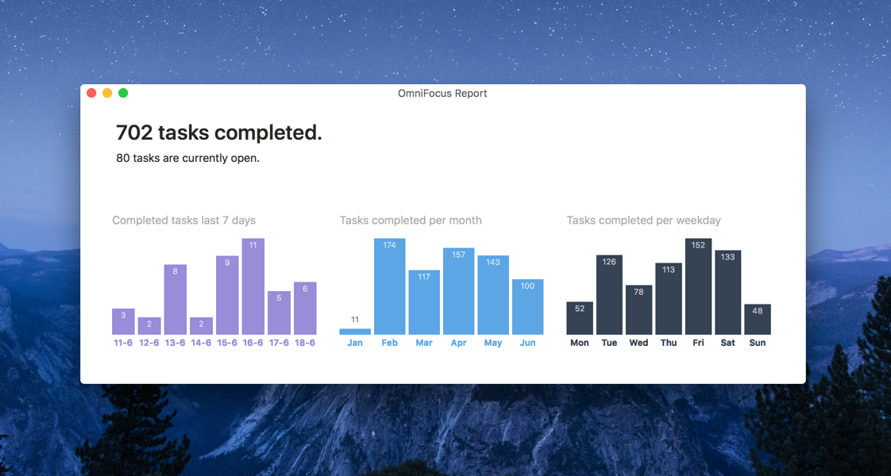

# Vibe

A tiny tool that allows you to see how you're doing with your [OmniFocus](https://www.omnigroup.com/omnifocus/) tasks.

It retrieves the completed dates of all your OmniFocus tasks, and shows you the number of completed tasks over the last 7 days, per month and per weekday. Feel free to extend it with more interesting stats, and if you use it and like it, I would love to [hear from you](https://twitter.com/tschoffelen).

**[Download the latest version here](https://github.com/tschoffelen/vibe/releases)**

### Send me a coffee
Like my work? [Consider giving a small donation](https://www.paypal.com/cgi-bin/webscr?cmd=_s-xclick&hosted_button_id=X8Y8GRHBU7V8N). 